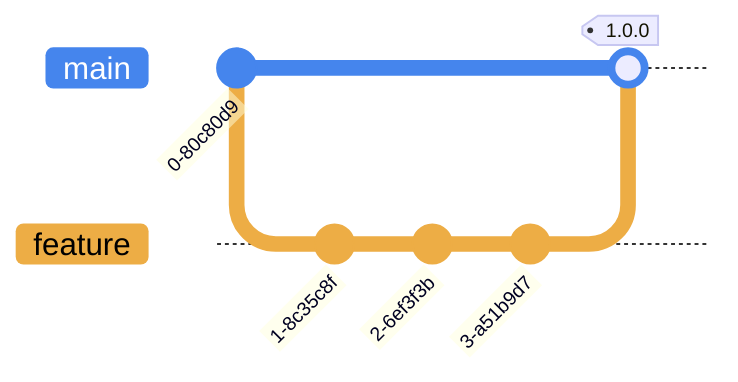

# ois-tuxedo-scripts

Jinja2 template maintenance scripts for [ois-tuxedo-stack](https://github.com/companieshouse/ois-tuxedo-stack) services.

These scripts are deployed via CI/CD jobs that utilise an Ansible playbook. For more information refer to the [ois-tuxedo-stack deployment branch](https://github.com/companieshouse/ois-tuxedo-stack/tree/deployment) and [Informix Management role](https://github.com/companieshouse/ansible-collection-middleware/tree/main/roles/informix_management).

## Branching Strategy

This project uses a trunk-based branching strategy and changes merged to the `main` branch are incorporated into versioned artefacts via the [ois-tuxedo-scripts](https://github.com/companieshouse/ci-pipelines/blob/master/pipelines/platform/team-platform/ois-tuxedo-scripts) pipeline:

## License

This project is subject to the terms of the [MIT License](/LICENSE).
